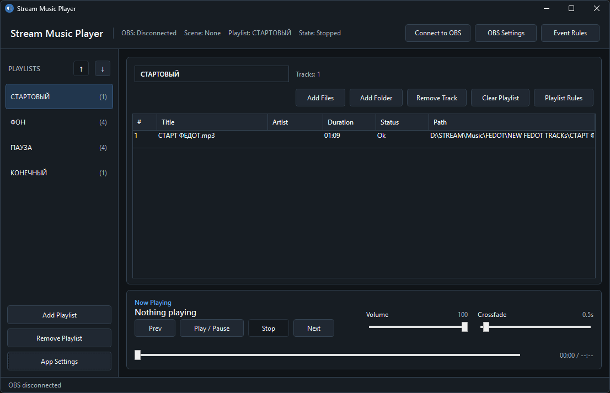
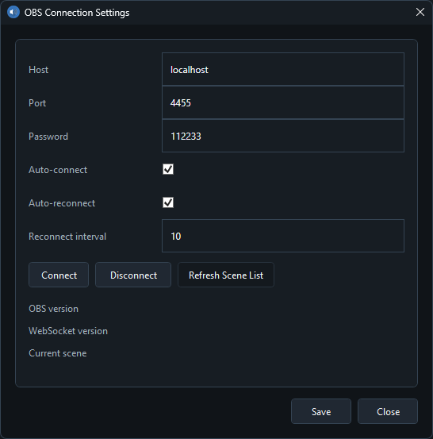
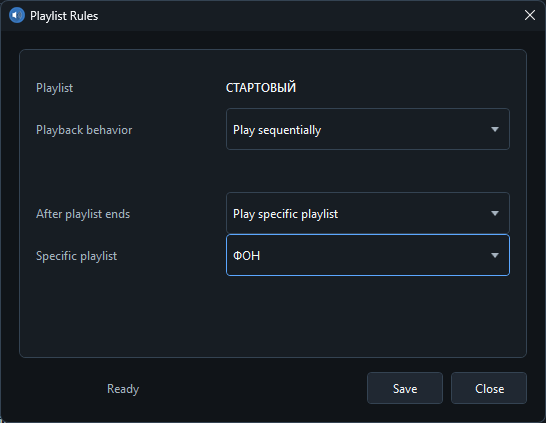
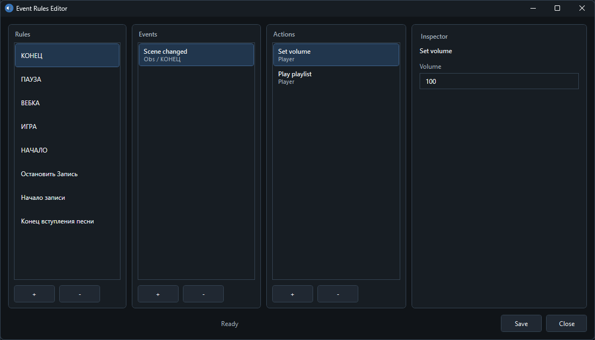
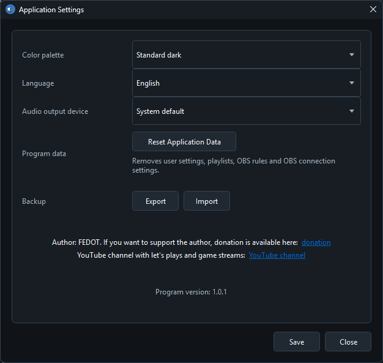

# Stream Music Player

Stream Music Player is a free and open-source Windows desktop music player for streamers, creators, and anyone who needs playlist-based music playback with automation.

The application can connect to OBS Studio through obs-websocket and react to local OBS events, but it is a standalone program. It is not an OBS plugin, is not bundled with OBS, and is not affiliated with or endorsed by the OBS Project.



## Overview

Stream Music Player helps you organize local music into playlists and automate playback during streams, recordings, scene changes, or other local workflow events.

It is especially useful when you want different music for different scenes, automatic transitions between playlists, event-based actions, or a separate music player that can be controlled by rules instead of manual clicks.

The project was created with the help of AI and is maintained as an open-source application under the MIT License.

## License

Stream Music Player is released under the MIT License.

MIT is a permissive open-source license. You may use, copy, modify, merge, publish, distribute, sublicense, and sell copies of the software, provided that the original copyright notice and license text are included.

MIT does not mean the project is public domain. Copyright remains with the author, but the license grants broad permissions to the community.

## Installation

1. Open the GitHub Releases page.
2. Download the latest release archive, for example `StreamMusicPlayer-v1.0.1.zip`.
3. Extract the archive to any folder on your Windows PC.
4. Run `StreamMusicPlayer.exe`.
5. Optional: if you want OBS interaction, enable the obs-websocket server in OBS Studio and configure the connection in Stream Music Player.

The application files can be placed anywhere. User data is stored separately in the Windows user profile.



## Main Features

### Playlist Management

- Create, rename, remove, and reorder playlists.
- Add individual audio files or whole folders.
- Remove tracks or clear an entire playlist.
- Reorder tracks by dragging them in the playlist table.
- Save playlist order and track order locally.

### Playback

- Play, pause, stop, previous, and next controls.
- Seek inside the current track.
- Smooth crossfade between tracks.
- Smooth crossfade-style seeking after releasing the seek slider.
- Global volume and crossfade settings saved between launches.
- Audio output device selection.
- Larger audio buffer for more stable playback during short system load spikes.

### Playlist Rules

Each playlist can define what happens during playback:

- play in order;
- repeat one track;
- repeat the entire playlist;
- reshuffle the playlist order between repeat cycles;
- stop after the playlist;
- switch to the previous playlist;
- switch to the next playlist;
- switch to a specific playlist.



### Event Rules

The modular event rules editor lets you build automation using separate blocks:

- rules;
- events;
- actions;
- action inspector.

A rule can contain multiple events and multiple actions. Actions can be reordered by dragging them in the action list.



### Supported Player Events

- playlist finished;
- track finished;
- playback stopped;
- playback paused;
- playback resumed.

### Supported Player Actions

- play playlist;
- play track;
- play next playlist;
- play previous playlist;
- stop;
- pause;
- resume;
- change global volume;
- change global crossfade.

### Optional OBS Interaction

Stream Music Player can connect to OBS Studio locally through obs-websocket. This allows the application to react to OBS events and send commands to OBS.

Supported OBS-related events include:

- scene changed;
- stream started;
- stream stopped;
- recording started;
- recording stopped;
- recording paused;
- recording resumed;
- scene source enabled;
- scene source disabled;
- source filter enabled;
- source filter disabled.

Supported OBS-related actions include:

- change scene;
- start stream;
- stop stream;
- start recording;
- stop recording;
- pause recording;
- resume recording;
- enable or disable a scene source;
- enable or disable a source filter.

OBS interaction is optional. The player can be used without connecting to OBS.

## Themes and Languages

Available themes:

- standard light;
- standard dark;
- cyberpunk;
- olive;
- midnight blue;
- dark red.

Available interface languages:

- English;
- Ukrainian;
- Russian;
- Polish.



## Data Storage

Stream Music Player stores user data locally in the Windows roaming application data folder:

```text
%APPDATA%\StreamMusicPlayer\
```

Typical full path:

```text
C:\Users\<UserName>\AppData\Roaming\StreamMusicPlayer\
```

Main database file:

```text
%APPDATA%\StreamMusicPlayer\app.db
```

This database stores:

- playlists;
- tracks;
- event rules;
- playlist rules;
- application settings;
- selected theme and language;
- audio output device setting;
- OBS connection settings.

Release archives do not include your personal `app.db` file. Your playlists, rules, and settings are not stored in the program release folder.

## Security and Privacy

Stream Music Player does not collect telemetry, analytics, personal data, OBS credentials, or streaming account information.

All OBS communication is performed locally through obs-websocket on the user's machine.

The application does not upload audio files, playlists, settings, stream data, or OBS data to external servers.

## Disclaimer

This software is provided as is, without warranty of any kind.

Use it at your own risk. The author is not responsible for lost data, interrupted streams, incorrect rule configuration, audio issues, OBS state changes, or any other direct or indirect damage caused by use of the application.

Always test your rules and OBS actions before using them in a live stream or recording session.

## OBS Independence Notice

Stream Music Player is an independent application.

It is not an OBS plugin. It is not part of OBS Studio. It is not affiliated with, sponsored by, approved by, or endorsed by the OBS Project.

OBS Studio and related names belong to their respective owners. Stream Music Player only communicates with OBS locally through obs-websocket when the user chooses to enable and configure that connection.

## Requirements

- Windows.
- .NET runtime compatible with the published build.
- Optional: OBS Studio with obs-websocket enabled for OBS interaction.

## Author

Author: FEDOT.

Donation: https://destream.net/live/FEDOT/donate

YouTube channel: https://www.youtube.com/channel/UCAPMkkZzlYhVX4Rn5hRCW9g
